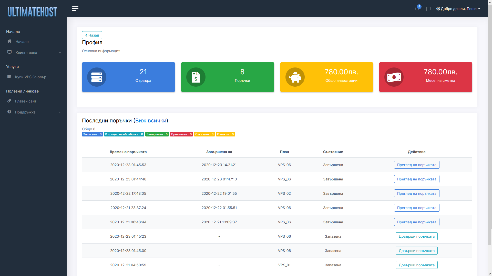

# Voxic

[Voxic](https://voxic.tk) is a VPS control panel in which you can buy, deploy and manage your VPS with ease.  
Virtual private servers are provided by [UltimateHost](https://www.uhost.pw).

## Used technologies and frameworks
* back-end - ASP.NET Core 5.0.  
* front-end - [jQuery](https://jquery.com/), [Vue.js](https://vuejs.org/) and [Bootstrap](https://getbootstrap.com/).
* database - [Microsoft SQL Server](https://www.microsoft.com/en-us/sql-server/sql-server-downloads)

The app is temporary hosted behind customized [Redbird Reverse Proxy](https://github.com/OptimalBits/redbird) and accessible on https://voxic.tk

## Screenshots

	<h3>For default users</h3>
	<table>
		<tr>
			<td>
				Plans 
				
			</td>
			<td>
				Profile 
				
			</td>
		</tr> 
		<tr>
			<td>
				Orders 
				
			</td>
			<td>
				Order Preview 
				
			</td>
		</tr>
	</table>
	

	<h3>For admins</h3>
	<table>
		<tr>
			<td>
				Promo Codes 
				
			</td>
			<td>
				Promo Code Preview 
				
			</td>
		</tr> 
	</table>

